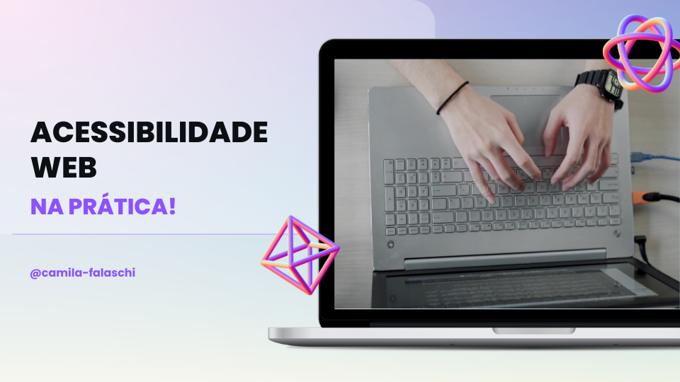

# Natural ou Fake Natty? ─ Acessibilidade Web na Prática!

## 📒 Descrição
Para esse projeto foi produzido um vídeo utilizando AIs Generativas para gerar o avatar, imagens e áudio.
O vídeo aborda o tema de Acessibilidade Web, mostrando como é um site acessível na prática.

> *Caso não seja possível visualizar o vídeo na pasta assets você pode conferir o vídeo no [YouTube](https://youtu.be/KskmOsaJz3Q),

## 🤖 Tecnologias Utilizadas
- [Canva](https://www.canva.com/)
- [ElevenLabs](https://beta.elevenlabs.io/)
- [Audacity](https://www.audacityteam.org/)
- [HeyGen](https://app.heygen.com/)

## 🧐 Processo de Criação
- O Canva foi utilizado para a criação do vídeo organizando as imagens, vídeos e áudios. Nele também foi gerado a imagem de fundo com a Mídia Mágica.
- O áudio foi gerado no ElevenLabs, utilizando o roteiro escrito pela autora.
- O Audacity foi utilizado para cortar o áudio gerando no ElevenLabs para posteriormente ser aplicado no HeyGen.
- O HeyGen foi utilizado através do seu plugin no Canva para gerar um vídeo com um avatar.

## 🚀 Resultados
Você pode conferir o vídeo produzido na pasta [assets](./assets/acessibilidade-web-na-pratica.mp4).

> Você pode assistir o vídeo no YouTube clicando na imagem abaixo. ↓

